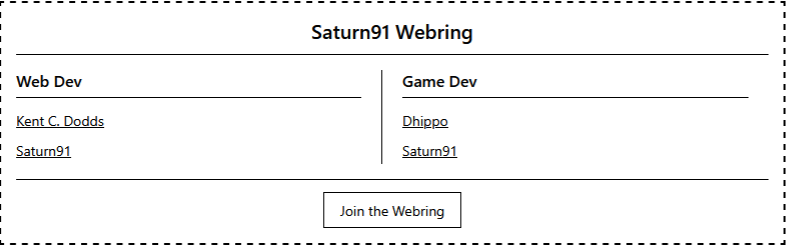

# Saturn Webring Widget

A lightweight, customizable webring widget that brings the spirit of the old web to modern websites. Easily showcase websites from different categories in your community.

You want to use it on your website and want to get your own website link added?
Please open up a PR in this repo [saturn91-webring-data](https://github.com/Saturn91/saturn91-webring-data)

## 🚀 Quick Start

### preview
<div align="center">
  
</div>

### Basic Usage

1. **Add a container to your HTML:**
   ```html
   <div id="saturn91-webring"></div>
   ```

2. **Include the widget script (choose one method):**

   **Option A: CDN (Recommended - No CORS issues)**
   ```html
   <script src="https://cdn.jsdelivr.net/gh/Saturn91/saturn91-webring-widget@latest/public/widget.js"></script>
   ```

   **Option B: Direct GitHub Pages**
   ```html
   <script src="https://saturn91.github.io/saturn91-webring-widget/public/widget.js"></script>
   ```

   **Option C: Self-hosted (Most reliable)**
   ```html
   <!-- Download widget.js and host it yourself -->
   <script src="/path/to/your/widget.js"></script>
   ```

That's it! The widget will automatically display links from the first available category.

### With Custom Categories

```html
<div id="saturn91-webring"></div>
<script 
    src="https://cdn.jsdelivr.net/gh/Saturn91/saturn91-webring-widget@latest/public/widget.js"
    data-categories="web-dev,game-dev">
</script>
```

## 📋 Configuration Parameters

All parameters are optional and can be added as `data-*` attributes to the script tag:

| Parameter | Description | Default | Example |
|-----------|-------------|---------|---------|
| `data-categories` | Comma-separated list of categories to display | First available category | `"web-dev,game-dev"` |
| `data-color` | Text and border color | `#000000` (black) | `"#ff0000"` |
| `data-background-color` | Background color | `#ffffff` (white) | `"#f5f5f5"` |
| `data-max-links` | Maximum links per category column | `4` | `"6"` |
| `data-border` | CSS border style for widget container | `1px solid var(--widget-color)` | `"2px dashed #ff0000"` |
| `data-source` | Custom data source URL | Saturn's webring data | `"https://mysite.com/webring/"` |

### Example with All Parameters

```html
<div id="saturn91-webring"></div>
<script 
    src="https://cdn.jsdelivr.net/gh/Saturn91/saturn91-webring-widget@latest/public/widget.js"
    data-categories="web-dev,game-dev"
    data-color="#333333"
    data-background-color="#f9f9f9"
    data-max-links="6"
    data-border="2px solid #0066cc"
    data-source="https://saturn91.github.io/saturn91-webring-data/public/">
</script>
```

## 🗂️ Available Categories

To see all available categories, check: **https://saturn91.github.io/saturn91-webring-data/public/index.json**

Current categories include:
- `web-dev` - Web Development
- `game-dev` - Game Development
- *(and more - check the index.json for the complete list)*

### Category Format

Category names in URLs use kebab-case (lowercase with hyphens), but are displayed with proper formatting:
- `web-dev` → "Web Dev"
- `game-dev` → "Game Dev"

## 🎨 Styling & Placement

### Container Placement

The widget will look for an element with `id="saturn91-webring"` and insert itself there. If no container is found, it will append to the document body.

```html
<!-- Widget appears here -->
<div id="saturn91-webring"></div>

<!-- Widget takes full width of container -->
<div id="saturn91-webring" style="max-width: 50%; margin: 0 auto;"></div>

<!-- In a sidebar -->
<aside>
    <h3>Community Links</h3>
    <div id="saturn91-webring"></div>
</aside>
```

### Color Themes

```html
<!-- Dark theme -->
<script 
    src="widget.js"
    data-color="#ffffff"
    data-background-color="#000000">
</script>

<!-- Custom brand colors -->
<script 
    src="widget.js"
    data-color="#0066cc"
    data-background-color="#f0f8ff">
</script>
```

### Border Styles

```html
<!-- No border -->
<script 
    src="widget.js"
    data-border="none">
</script>

<!-- Dashed border -->
<script 
    src="widget.js"
    data-border="2px dashed #ff0000">
</script>

<!-- Rounded border -->
<script 
    src="widget.js"
    data-border="1px solid #333"
    style="border-radius: 8px;">
</script>

<!-- Thick colorful border -->
<script 
    src="widget.js"
    data-border="4px solid #00ff00">
</script>
```

## 🔧 Advanced Usage

### Custom Data Source

Host your own webring data by providing a custom data source:

```html
<script 
    src="widget.js"
    data-source="https://mywebsite.com/webring-data/">
</script>
```

Your data source must provide:
- `index.json` - List of available categories
- `{category}.json` - Individual category files

#### Data Structure

**index.json:**
```json
{
  "categories": ["web-dev", "game-dev", "art-design"]
}
```

**web-dev.json (example):**
```json
{
  "links": [
    {
      "owner": "Username",
      "url": "https://example.com",
      "languages": ["en"],
      "country": "us"
    }
  ]
}
```

### Widget Behavior

- **Link Shuffling**: Links are randomly shuffled on each page load
- **Responsive Design**: Automatically adapts to container width
- **Error Handling**: Shows "Something went wrong" if data can't be loaded
- **Fallback**: Uses document.body if no container found

## 📝 How to Join the Webring

Want to add your website to the Saturn Webring? Follow these steps:

### 1. Choose Your Category

Check available categories at: https://saturn91.github.io/saturn91-webring-data/public/index.json

### 2. Submit a Pull Request

1. **Fork the repository**: https://github.com/Saturn91/saturn91-webring-data
2. **Edit the appropriate category file**: `public/{category-name}.json`
3. **Add your entry**:
   ```json
   {
     "owner": "YourUsername",
     "url": "https://yourwebsite.com",
     "languages": ["en"],
     "country": "us"
   }
   ```
4. **Submit your pull request**

### 3. Entry Format

| Field | Description | Required | Example |
|-------|-------------|----------|---------|
| `owner` | Your name/username | ✅ | `"Saturn91"` |
| `url` | Your website URL | ✅ | `"https://saturn91.dev"` |
| `languages` | Array of language codes | ✅ | `["en", "de"]` |
| `country` | Two-letter country code | ✅ | `"ch"` |

### 4. Guidelines

- ✅ **Active websites only** - Your site should be live and maintained
- ✅ **Relevant content** - Match the category you're joining
- ✅ **Family-friendly** - Keep content appropriate for all audiences
- ✅ **No spam or advertising-only sites**

## 🌐 Examples

### Minimal Setup
```html
<!DOCTYPE html>
<html>
<body>
    <h1>My Website</h1>
    <div id="saturn91-webring"></div>
    <script src="https://cdn.jsdelivr.net/gh/Saturn91/saturn91-webring-widget@latest/public/widget.js"></script>
</body>
</html>
```

### Sidebar Integration
```html
<aside class="sidebar">
    <h3>Community</h3>
    <div id="saturn91-webring" style="font-size: 14px;"></div>
</aside>
<script 
    src="https://cdn.jsdelivr.net/gh/Saturn91/saturn91-webring-widget@latest/public/widget.js"
    data-categories="web-dev"
    data-max-links="3">
</script>
```

### Footer Widget
```html
<footer>
    <div id="saturn91-webring" style="max-width: 800px; margin: 0 auto;"></div>
</footer>
<script 
    src="https://cdn.jsdelivr.net/gh/Saturn91/saturn91-webring-widget@latest/public/widget.js"
    data-categories="web-dev,game-dev,art-design"
    data-max-links="2">
</script>
```

## 🐛 Troubleshooting

### Script Loading Issues (CORS/Security)
- **Problem**: Script blocked by browser security policies
- **Solution**: Use the CDN version: `https://cdn.jsdelivr.net/gh/Saturn91/saturn91-webring-widget@latest/public/widget.js`
- **Alternative**: Download and self-host the widget.js file
- **Note**: Some corporate firewalls may block external scripts entirely

### Widget Not Appearing
- Check that you have a `<div id="saturn91-webring"></div>` in your HTML
- Verify the script URL is correct and accessible
- Check browser console for error messages
- Try the CDN version if using GitHub Pages direct link

### No Links Showing
- Verify category names match those in index.json
- Check network connectivity to data source
- Look for "Something went wrong" message indicating data fetch failure

### Styling Issues
- The widget uses CSS variables and should inherit your page's font
- Container width affects layout - ensure adequate space
- Use browser dev tools to inspect and debug styling

## 📄 License

MIT License - Feel free to use and modify as needed.

## 🤝 Contributing

Contributions welcome! Please submit issues and pull requests to improve the widget.

---

**Made with ❤️ for the indie web community**